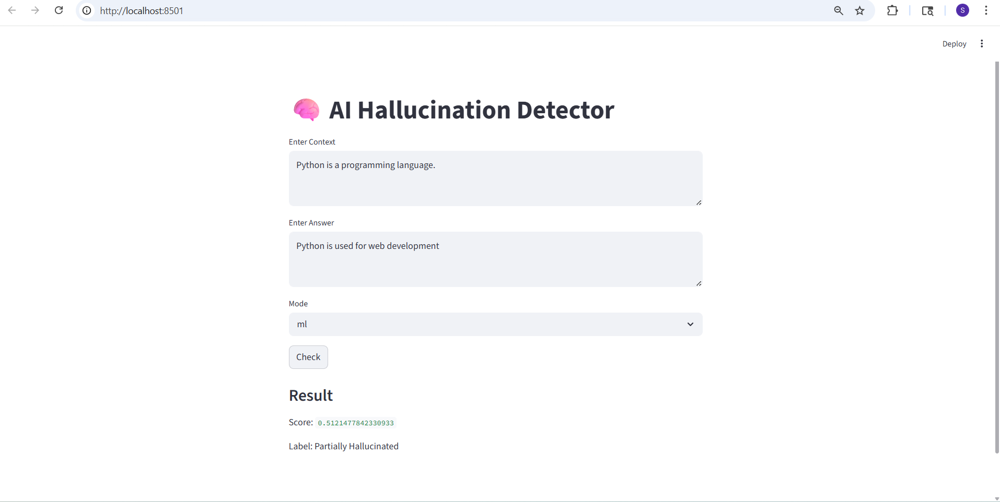
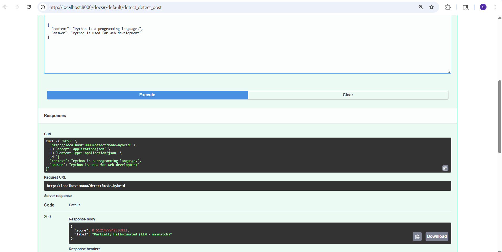

# 🧠 AI Hallucination Detector

An end-to-end AI system that detects hallucinations in LLM-generated answers using a **Hybrid approach (ML + LLM reasoning)**.

---

## 🚀 Features

* ✅ Detects **Grounded / Partially Hallucinated / Hallucinated**
* ✅ Combines:

  * Semantic similarity (Sentence Transformers)
  * Keyword overlap
  * Entity mismatch detection
* ✅ LLM-based reasoning using Ollama
* ✅ Hybrid decision system (ML + Rule + LLM)
* ✅ Interactive UI using Streamlit
* ✅ Fully Dockerized (FastAPI + Streamlit)
* ✅ Evaluated model performance using custom dataset
* ✅ Compared ML vs LLM vs Hybrid approaches
---

## 🏗️ Tech Stack

* **Backend:** FastAPI
* **Frontend:** Streamlit
* **ML Model:** sentence-transformers (all-MiniLM-L6-v2)
* **LLM:** Ollama (phi model)
* **Deployment:** Docker & Docker Compose

---

## ⚙️ Architecture

User Input → Streamlit UI → FastAPI API →
ML Model (Similarity + Keywords + Mismatch) →
Hybrid Logic → LLM (if needed) → Final Output

---

## 🧠 How It Works

### 1. ML Scoring

* Semantic similarity between context & answer
* Keyword overlap
* Entity mismatch penalty

### 2. Hybrid Logic

* High confidence → ML result
* Low confidence → ML result
* Uncertain → LLM reasoning

### 3. LLM Validation

* Uses Ollama to validate factual grounding

---

## 🐳 Run with Docker

### 1. Clone repo

```bash
git clone https://github.com/YOUR_USERNAME/ai-hallucination-detector.git
cd ai-hallucination-detector
```

### 2. Run project

```bash
docker-compose up --build
```

### 3. Open apps

* 🌐 Streamlit UI: http://localhost:8501
* ⚡ FastAPI Docs: http://localhost:8000/docs

---

## 🧪 Example

### Input

Context:
Python is a programming language.

Answer:
Python is used for web development.

### Output

### Streamlit UI


### Backend


### Score: 0.51
### Label: Partially Hallucinated

---

## 📊 Modes

* `ml` → Only ML scoring
* `llm` → Only LLM reasoning
* `hybrid` → Combined (recommended)

---

## 📁 Project Structure

```
app/
  main.py
  detector.py
  llm_detector.py

tests/
  evaluate.py
  compare_model.py

docker-compose.yml
Dockerfile
docker.streamlit
app.py (Streamlit UI)
requirements.txt
```

---

## 💡 Key Highlights

* Built a **real-world GenAI system**
* Handles hallucination detection using hybrid logic
* Designed for **scalability & production deployment**
* Solves real problem in LLM reliability

---

## 🚀 Future Improvements

* Add NER-based entity extraction
* Improve LLM prompt reliability
* Add confidence calibration
* Deploy on cloud (AWS / Azure)

---

## 👩‍💻 Author

Sneha Wayadande

---

## ⭐ If you like this project, give it a star!
